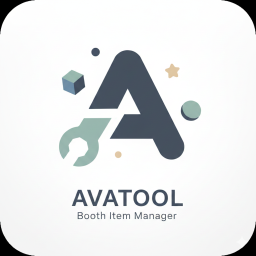
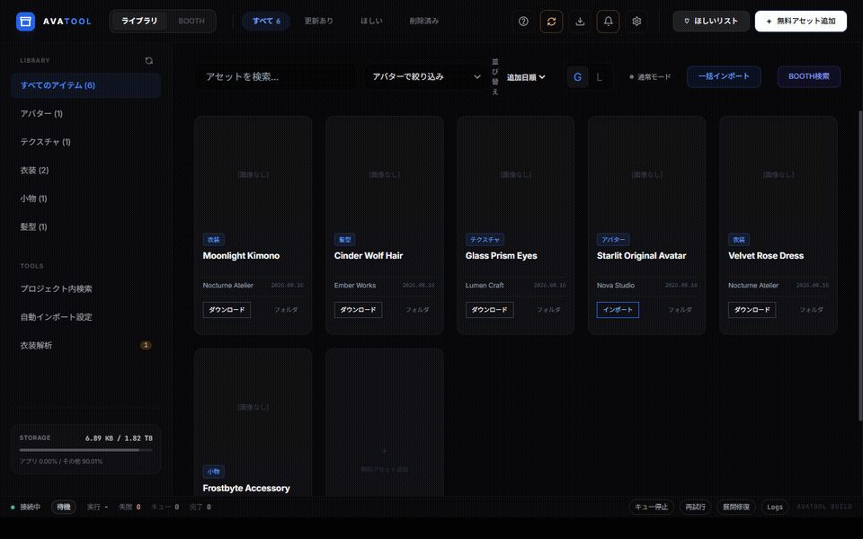
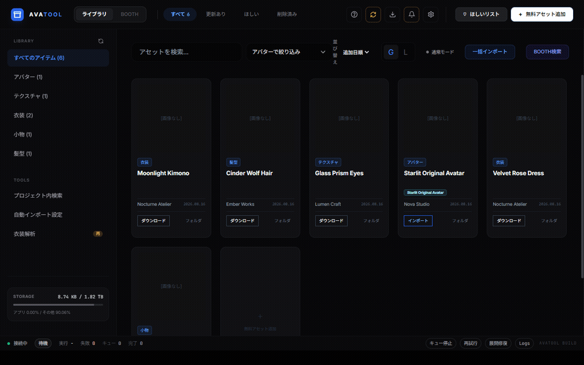
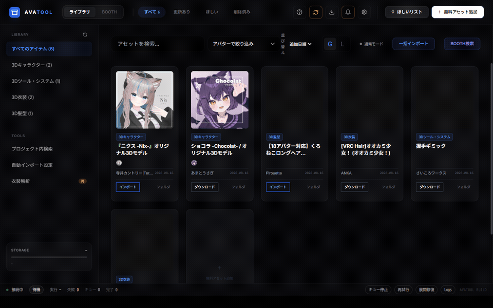
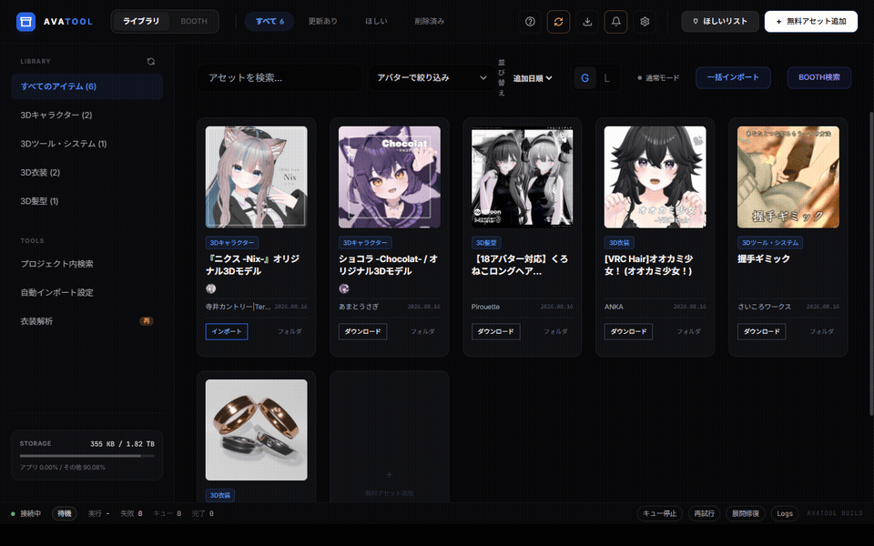

<p align="center">
  
</p>

<h1 align="center">Avatool</h1>

<p align="center">
  <strong>BOOTH の購入アセット管理から Unity インポートまでをまとめて自動化する、VRChat クリエイター向け Windows デスクトップツール。</strong>
</p>

<p align="center">
  Library sync → Download → Extract → Unity import → VCC / VPM setup
</p>

<p align="center">
  <a href="https://github.com/nyarurant/avatool-oss/actions/workflows/ci.yml"></a>
  
  
  
  
</p>

<p align="center">
  
</p>

<p align="center">
  <a href="#avatool-とは">概要</a> ·
  <a href="#demo">Demo</a> ·
  <a href="#主な機能">機能</a> ·
  <a href="#セットアップ">セットアップ</a> ·
  <a href="#開発">開発</a> ·
  <a href="#既知の制限">制限</a>
</p>

---

## Avatool とは

**Avatool** は、VRChat アバター改変で繰り返し発生する BOOTH アセット管理と Unity への導入作業をまとめて処理する Electron アプリです。

BOOTH で購入したアセットを一覧化し、更新差分を確認し、必要なファイルをダウンロードして展開し、`.unitypackage` を Unity プロジェクトへ投入するところまでを 1 つの UI から扱えます。

VCC / VPM とも連携できるため、新しいプロジェクトに Modular Avatar、NDMF、liltoon などを導入する初期セットアップも自動化できます。

> **English summary:** Avatool is a Windows desktop application for VRChat creators that automates the BOOTH asset lifecycle: library synchronization, downloads, archive extraction, Unity imports, VCC/VPM integration, and repeatable project setup.

### 何が変わるか

| 手作業 | Avatool |
|---|---|
| BOOTH の購入ページを何度も開く | 購入ライブラリを一覧化して同期 |
| zip / 7z / rar を手で展開する | ダウンロード後に自動展開 |
| `.unitypackage` を探して Unity にドラッグする | 対象パッケージを収集してインポート |
| 「どのプロジェクトに入れたか」を覚えておく | インポート履歴を記録 |
| 更新された商品を自分で探す | 再同期時に更新差分を検出 |
| MA / NDMF / liltoon を新規プロジェクトごとに入れる | VCC / VPM 連携で初期導入を自動化 |
| 複数プロジェクトへ同じ操作を繰り返す | ルールとキューでまとめて処理 |

### 基本フロー

```text
BOOTH library
     │
     ▼
Library sync / diff detection
     │
     ▼
Download
     │
     ▼
Archive extraction
     │
     ▼
.unitypackage collection
     │
     ├── Unity running ──► Live import
     │
     └── Unity closed  ──► batchmode import
                              │
                              ▼
                    History / metadata
```

---

## Demo

### Download → Unity import

<p align="center">
  
</p>

### Library / filtering / project workflow

<table>
  <tr>
    <td width="50%" valign="top">
      <strong>Library sync</strong><br><br>
      
    </td>
    <td width="50%" valign="top">
      <strong>Avatar filter</strong><br><br>
      
    </td>
  </tr>
  <tr>
    <td width="50%" valign="top">
      <strong>Batch import</strong><br><br>
      
    </td>
    <td width="50%" valign="top">
      <strong>Project items</strong><br><br>
      
    </td>
  </tr>
</table>

---

## 主な機能

### BOOTH ライブラリ管理

- 購入アセットの一覧取得とローカル同期
- 新規 / 更新あり / 変化なしの差分判定
- 未ダウンロード / 未インポート / 更新ありでの絞り込み
- アバター別フィルタリング
- 商品名・作者名での検索
- BOOTH URL / 商品 ID からの手動追加
- サムネイルキャッシュとプレビュー
- 対応アバター情報の表示

### Download / archive processing

- 複数アセットの一括ダウンロード
- バックグラウンドダウンロード
- zip / 7z / rar の展開
- パスワード付きアーカイブへの対応
- 入れ子を含む `.unitypackage` の再帰収集
- 同梱ファイルの個別選択
- 更新ファイルの再取得
- 失敗項目だけのリトライ
- リアルタイム進捗表示

### Unity import

- Unity 起動状態に応じた実行経路の切り替え
- 起動中プロジェクトへの Live import
- `Unity.exe -batchmode` を使ったバックグラウンドインポート
- 複数パッケージのキュー処理
- 複数プロジェクトへの投入
- 同一プロジェクトへの重複実行ロック
- インポート進捗の表示
- 実行履歴とエラー結果の保存
- 失敗パッケージのみの再実行

### VCC / VPM

- VCC のプロジェクト一覧を同期
- VPM パッケージの導入
- manifest の依存関係反映
- 導入済みバージョンの追跡
- Modular Avatar / NDMF / liltoon / SimpleFolderIcon などのセットアップ補助
- FaceEmo など `.unitypackage` ベースの導入にも対応

### Auto Bootstrap

プロジェクト検知後の初期処理を連続して実行できます。

```text
Project detected
      │
      ▼
VPM setup
      │
      ▼
Asset selection
      │
      ▼
Unity import
      │
      ▼
Result recording
```

プロジェクト名やパスに応じたルールを設定できるため、PC / Quest / Test など用途ごとに処理内容を変えられます。

### その他

- 定時自動ダウンロード
- light / balanced / fast の処理プロファイル
- 設定プロファイルの保存と復元
- ライブラリ / 設定 / ダウンロード済みデータのエクスポート・インポート
- カスタマイズ可能なキーボードショートカット
- 操作ログと通知
- 起動時ヘルスチェック
- アプリ内自動アップデート

---

## Unity import modes

Avatool は通常インポートとバックグラウンドインポートの 2 経路を持っています。

| | Live import | Background import |
|---|---|---|
| 対象 Unity | 起動中のプロジェクト | Unity を閉じた状態でも可 |
| 実行方式 | Unity Editor 側の bridge | `Unity.exe -batchmode` |
| 少量の即時投入 | 向いている | 可能 |
| 大量処理 | 不向き | 向いている |
| 夜間・放置運用 | 不向き | 向いている |
| 複数プロジェクト | 1 プロジェクトずつ | 順次処理可能 |

インポート前にはプロジェクトパス、パッケージパス、多重実行状態などを検証します。

---

## セットアップ

### 動作環境

| 項目 | 要件 |
|---|---|
| OS | Windows 10 / 11 64-bit |
| BOOTH account | 購入ライブラリ同期・ダウンロード機能で必要 |
| Unity Editor | Unity import を使用する場合に必要 |
| VCC | VCC / VPM 連携を使用する場合に必要 |
| Internet | BOOTH 同期・ダウンロード・アップデートで必要 |

### 配布版

Avatool の配布版は updater CDN を使用しています。

- [配布メタデータ `latest.yml`](https://cdn.necco.xyz/file/avatool/latest.yml)

アプリ起動時に更新を確認し、新しいバージョンがある場合はアプリ内から適用できます。

### 初回設定

1. Avatool を起動して BOOTH にログイン
2. ライブラリ同期を実行
3. Unity import を使う場合は `Unity.exe` のパスを設定
4. VCC 連携を使う場合は VCC プロジェクトを同期
5. 必要に応じて Auto Bootstrap / project rules を設定

### データ保存先

主なユーザーデータは次の場所に保存されます。

```text
%APPDATA%\avatool\
```

ダウンロードデータ、メタ情報、履歴などはこの配下で管理されます。

---

## よく使う操作

| やりたいこと | 操作 |
|---|---|
| 新しく購入したアセットを反映 | ライブラリ同期 |
| 更新されたアセットだけ確認 | 「更新あり」でフィルター |
| 特定アバター向けだけ表示 | アバターフィルター |
| 複数アセットを先に保存 | 複数選択 → Download |
| Unity を開いたまま追加 | Live import |
| Unity を閉じてまとめて処理 | Background import |
| VCC の新規プロジェクトを反映 | VCC project sync |
| 新規プロジェクトを自動セットアップ | Auto Bootstrap |
| 失敗原因を確認 | Operation log |

---

## 認証とローカルデータ

BOOTH の認証状態は Electron の `safeStorage` を利用してローカルに保存します。

- ブラウザの BOOTH セッションとは独立
- 認証状態は端末側で暗号化して保存
- PC 移行時は BOOTH への再ログインが必要
- インポート履歴やダウンロードデータは `%APPDATA%\avatool\` 配下に保存

ユーザーデータを手動で移動・削除すると Avatool が保持しているファイルパスと一致しなくなる場合があります。

---

## 開発

### Requirements

- Windows
- Node.js 22.x
- npm
- Unity / VCC は、該当連携を実際に検証する場合のみ必要

### Start

```bash
npm ci
npm start
```

CSS を再生成して起動する場合:

```bash
npm run start:rebuild
```

### Quality checks

```bash
npm run lint
npm run test:unit
npm test
```

Coverage:

```bash
npm run test:unit:coverage
```

### Build

Windows NSIS installer:

```bash
npm run dist:win
```

Packaged directory only:

```bash
npm run pack
```

### README demo recording

README の GIF はアプリの実 UI を CDP 経由で操作し、ffmpeg で記録できます。

```bash
npm run demo:readme
npm run demo:library-sync
npm run demo:avatar-filter
npm run demo:batch-import
npm run demo:project-items
```

デモ専用コードは通常配布バイナリには含まれません。

---

## CI

GitHub Actions では Windows 上で次を実行します。

```text
npm ci
npm run lint
npm run test:unit
```

Workflow: [`.github/workflows/ci.yml`](.github/workflows/ci.yml)

---

## Repository layout

```text
avatool/
├─ .github/workflows/    # CI
├─ __tests__/            # Jest tests
├─ assets/               # icons, styles, README demos
├─ lib/                  # application services / core logic
├─ renderer/             # renderer-side modules
├─ scripts/              # build, debug, demo, release tooling
├─ PatchNote/            # version-by-version patch notes
├─ main.js               # Electron main process
├─ preload.js            # renderer bridge
├─ render.js             # renderer entry
└─ package.json
```

---

## FAQ

### Unity を起動しておく必要はある？

必須ではありません。起動中プロジェクトへすぐ投入する経路と、Unity を閉じた状態から batchmode で処理する経路があります。

### 1 商品に複数の `.unitypackage` がある場合は？

収集されたファイルから対象を選択できます。すべてを選択することも、一部だけを選ぶこともできます。

### BOOTH の商品が更新されたら自動で分かる？

ライブラリ同期時に差分を検出します。リアルタイム push 通知ではありません。

### 複数 BOOTH アカウントは使える？

現在は 1 アカウントを前提としています。

### PC を移行したら BOOTH のログイン状態も移せる？

認証情報は端末側の暗号化に依存するため、移行後は再ログインが必要です。

### ダウンロードとインポートを別の日に実行できる？

できます。先にダウンロードだけ完了させ、後から Unity import を実行できます。

---

## 既知の制限

- Windows 専用です
- BOOTH アカウントは現在 1 アカウントを前提としています
- BOOTH 側の変更はライブラリ同期を実行するまで反映されません
- 同一 Unity プロジェクトへの並列インポートは行いません
- batchmode は対象プロジェクトに対応した Unity Editor と有効な Unity 環境を必要とします
- BOOTH 以外のアセットでは自動ダウンロードや更新検出を利用できません
- 大量の購入履歴を初回同期する場合は処理に時間がかかることがあります

---

## Patch notes

変更履歴は [`PatchNote/`](PatchNote/) にバージョンごとに保存しています。

README 側に「最新バージョン」を固定記載せず、`package.json` とパッチノートを基準に管理します。

---

## License

ISC License

---

<p align="center">
  <strong>Avatool</strong><br>
  BOOTH × Unity asset workflow automation for VRChat creators.
</p>
